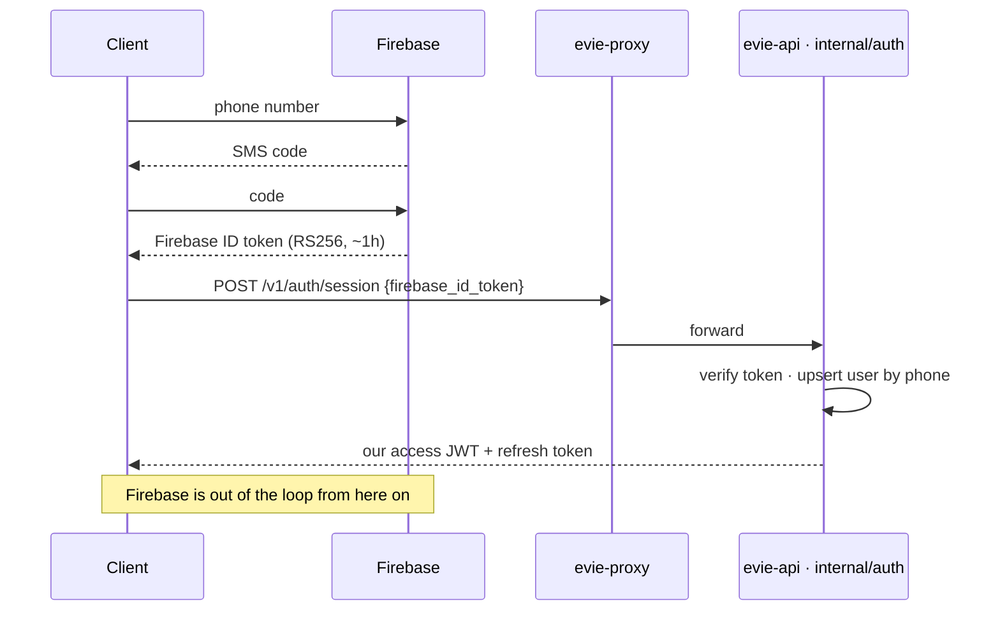
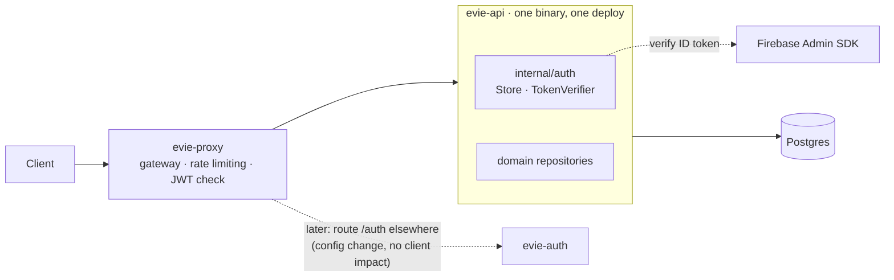

<!-- markdown-link-check-disable -->
# ADR-001: Auth architecture

### Status

Implemented. Amends [rfc-001](../rfcs/rfc-001-phone-otp-login.md) — replaces its
self-managed OTP design, retains its session model unchanged.

## Context

Two questions, one answer:

| Question | Forcing constraint |
| --- | --- |
| Who verifies the phone number? | Self-managed OTP needs **India DLT registration**, which needs an Indian entity we don’t have. It was the only launch-blocking clock. |
| Where does auth code live? | `evie-auth` and `evie-api` shared the `users` table and the `evie-domain` module — same deploy, same DB, on one EC2 box. |

*Who verifies the phone* and *who owns the session* are separable.
Separating them is the whole decision.

## Decision

### 1 · Firebase verifies, we issue the session

Firebase is the *phone-proof provider*, nothing more.
It replaces OTP generation and delivery; it does **not** replace our session model.
The ID token is exchanged **exactly once**, so a stolen one has a bounded (~1h) window
and cannot be replayed after exchange.

### 2 · Auth is a bounded context inside `evie-api`

One binary, one database, one deploy.
`evie-proxy` stays separate and resolves each context to an upstream URL on its own — so
extracting auth later is a proxy config change, invisible to clients.

**Seams we hold to keep that cheap:** `Store` and `TokenVerifier` stay interfaces, and
the auth package never reads another context’s tables or reaches into the DB for domain
data.

### Token verification (security-critical)

Use the Firebase Admin SDK — do not hand-roll.
Enforce **all**:

| Check | Why |
| --- | --- |
| Signature valid against Google’s rotating keys; `alg == RS256` | Authenticity |
| `aud == <project-id>`, `iss == https://securetoken.google.com/<project>` | Token is ours |
| `exp`, `iat`, `auth_time` valid | Not expired, not future-dated |
| **`firebase.sign_in_provider == "phone"` + non-empty `phone_number`** | **Load-bearing.** Without it, a Google/email/anonymous token from the same project mints a session with *no phone proof* |
| Account bound to stable `firebase_uid` | `phone_number` (E.164) is the human anchor; `firebase_uid` is the join key |

### Data model

| Entity | Change |
| --- | --- |
| `User` | **+** `firebase_uid` (unique), **+** `role` (default `user`); `phone_verified_at` sourced from the verified token |
| `OtpChallenge` | **Removed** — Firebase owns code state |
| `Device`, `RefreshToken` | Unchanged |

### Retained from rfc-001, unchanged

HS256 access token + opaque, server-stored, **rotating** refresh token, with
**reuse-detection → family revoke**, device binding, and server-side revocation.
`user`/`moderator`/`admin` roles in access-token claims; elevation stays an out-of-band
admin action, never a login path.
`POST /auth/token/refresh` and `POST /auth/logout` unchanged.

### Dev vs production

One code path, config flip only:

|  | SMS | DLT |
| --- | --- | --- |
| **Dev / closed beta** | Firebase test phone numbers (fixed codes) or Auth Emulator | None |
| **Production** | Live Firebase SMS | **None on our side** — Google delivers |

Request-side rate limiting (per-phone/IP/device) is Firebase’s, with App Check /
reCAPTCHA for abuse.
We rate-limit `/auth/session` and `/auth/token/refresh` at `evie-proxy`; the auth
context itself is issuance-only and middleware-free by design.

## Consequences

| ✅ Positive | ⚠️ Tradeoff |
| --- | --- |
| **DLT leaves the critical path** — the entity task drops from launch blocker to “needed for a GCP billing account” | **Hard Firebase dependency** — an outage blocks *new* logins (existing sessions keep refreshing; our refresh tokens are independent) |
| We own far less: no code generation/storage, no SMS integration, no OTP abuse controls | Client is bound to the Firebase SDK for verification |
| Session model, roles, rotation, reuse-detection, revocation — untouched | Billed per verification and a toll-fraud (SMS-pumping) target; needs App Check / reCAPTCHA |
| Dev and production converge on one flow | **Data residency** — Firebase stores phone numbers; must fit our privacy posture |
| One binary, one deploy; `users` stops being a cross-service table; the `:8081` port clash is gone | Weaker wall between auth and the rest of the API — a bad import could couple them. Interface seams + code review, not a hard boundary |

## Alternatives Considered

| Alternative | Verdict |
| --- | --- |
| **Full Firebase Auth** (Firebase owns identity *and* sessions) | **Rejected** — discards our rotating refresh tokens, reuse-detection, device binding, and revocation; pushes roles into custom claims that propagate with ~1h lag |
| **Self-managed OTP + raw SMS** (Twilio Verify / MSG91) | **Deferred, not rejected** — the fallback if Firebase pricing, India deliverability, or data residency disappoint. Its blocker (DLT) is exactly what this ADR routes around |
| **Email magic links / OAuth / passwords** | **Rejected** in rfc-001 §Alternatives; unchanged |
| **Keep auth as its own service** | **Rejected for now** — a single EC2 box gets every cost of a split and none of the gain. The gain starts the day a second machine exists, and the proxy already buys us that day |
| **Fold auth in *and* drop the proxy** | **Rejected** — the proxy is the piece that keeps the door open |

## Open items

Tracked, not blocking:

- Firebase **India deliverability, latency, and pricing at scale**. First real +91
  delivery confirmed 2026-07-11; scale behavior unknown.
- **App Check / reCAPTCHA** enforcement plan against SMS toll fraud.
- **Data-residency / privacy** review for Firebase-stored phone numbers.
- Still pending in code: refresh-reuse **family revoke**, and the Postgres store.

## Related Resources

- [rfc-001 — Phone Number OTP Login](../rfcs/rfc-001-phone-otp-login.md) (amended by
  this ADR)
- [rfc-003 — Platform Conventions](../rfcs/rfc-003-platform-conventions.md) (session/JWT
  model)
- prd-001 §5.1 (account model), §2.1 (roles)
- `evie-services/evie-api/AUTH.md` — how the auth context is laid out in code
- `evie-services/services.md` — service map, updated to reflect this decision
