# Flow A — Help a dog

A signed-in member opens the app, optionally switches locality, and chooses how to help
a dog they have spotted: either **report it to the group** (kicks off the moderated case
flow) or **help it themselves** (offline action with optional post-action logging into
the datastore).

| Field | Value |
| --- | --- |
| **Actor** | Rescuer / Member |
| **Goal** | Get help to a dog — via the community or directly |
| **Preconditions** | Signed in via phone OTP (see [rfc-001](../rfcs/rfc-001-phone-otp-login.md)); member is in at least one locality group (PRD §3.2) |
| **Trigger** | User taps “Help a dog” on the home feed |
| **Postcondition** | Either a “Submitted / Unverified” case exists on the feed, or a `CareLog` entry exists in the datastore, or nothing is recorded — see branches below |

## Diagram

```mermaid
flowchart LR
    Start([Open app]) --> Feed["Home feed"]
    Feed -. optional .-> Loc[/"Switch location"/]
    Loc -.-> Feed

    Feed --> Choice{Action?}
    Choice -->|Open a case| OpenCase["Open existing<br/>case thread"]
    Choice -->|Help a dog| How{How does the user<br/>want to help?}

    %% Branch 1 — Report to the group
    How -->|Report to the group| QRq{Dog has<br/>QR tag?}
    QRq -->|Yes — preferred| Scan["Scan QR tag<br/>pre-fill details"]
    QRq -->|No — fallback| Manual["Enter manually"]
    Scan --> Form["Add photo, location,<br/>type, condition, note"]
    Manual --> Form
    Form --> Submit[/"Submit"/]
    Submit --> Pending["Submitted / Unverified<br/>greyed card"]
    Pending --> Gate{Moderator<br/>Gate 1}
    Gate -->|Validate + severity| Active["Active case<br/>on feed"]
    Gate -->|Reject| Rejected([Rejected])
    Active --> NewThread["Case thread:<br/>updates, replies,<br/>request closure"]

    %% Branch 2 — Help it myself (TBD)
    How -->|Help it myself| Resources["Resources screen TBD<br/>partner vets, emergency,<br/>auto drivers, etc."]
    Resources --> Action(["User acts offline"])
    Action -. optional later .-> LogPrompt{Log this rescue?}
    LogPrompt -->|Skip| End1([Done])
    LogPrompt -->|Yes — quick| LogForm[/"Minimal log:<br/>location, type, outcome<br/>optional photo + QR"/]
    LogForm --> SelfLog["CareLog created<br/>view-only, no gate"]
    SelfLog --> End2([Logged])

    OpenCase --> Coord([Coordinate])
    NewThread --> Coord

    classDef se fill:#e8f5e9,stroke:#2e7d32,color:#1b5e20;
    classDef dec fill:#fff3e0,stroke:#ef6c00,color:#e65100;
    classDef tbd fill:#fce4ec,stroke:#ad1457,color:#880e4f,stroke-dasharray: 4 3;
    class Start,Coord,Rejected,End1,End2,Action se;
    class Choice,How,QRq,Gate,LogPrompt dec;
    class Resources,LogForm,SelfLog tbd;
```

**Legend:** green = entry/exit, orange = decision, dashed pink = TBD / not yet in the
PRD.

## Branches

### Branch 1 — Report to the group (moderated)

The canonical case flow.
QR-tag scan is preferred (gives the dog a unique identity); manual entry is the
fallback. Submission creates a “Submitted / Unverified” card, greyed on the feed until a
moderator validates and assigns severity at **Gate 1** (PRD §5.5, §6). This gate is the
documented bottleneck for time-to-first-response (PRD §10 — “Moderator availability”
risk).

### Branch 2 — Help it myself (offline + optional log)

The user wants to act *now*: the app’s job is to **serve them first** and **capture data
second**. The Resources screen (partner vets, emergency services, auto-driver contacts,
etc. — content TBD) is shown immediately, with no form in the way.
After the action — or whenever the user comes back — they are optionally prompted to log
it. If they accept, a minimal `CareLog` entry is created in the datastore: view-only, no
moderator gate, not on the main feed.

The rationale and principles for capturing self-help are in
[memo-001](../memos/memo-001-self-help-capture.md); the detailed `CareLog` model will be
defined in a follow-up RFC and is not yet in PRD §7.

## Doc gaps surfaced by this flow

| Concept | Where it belongs | Status |
| --- | --- | --- |
| “Help a dog” button (entry point) | PRD §5.2 Home Feed | not yet specified |
| Location switcher (top bar) | PRD §5.2 | not yet specified |
| QR-tag → Dog identity (Dog/Tag entity) | PRD §5.3 + §7 | WIP |
| “Help it myself” → Resources screen | New PRD §5.X | not yet specified |
| `CareLog` entity & lifecycle | PRD §7 + future RFC | proposed in [memo-001](../memos/memo-001-self-help-capture.md) |
