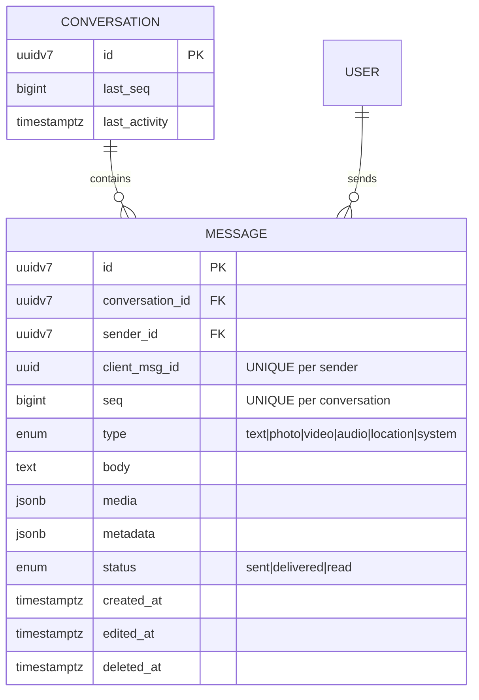
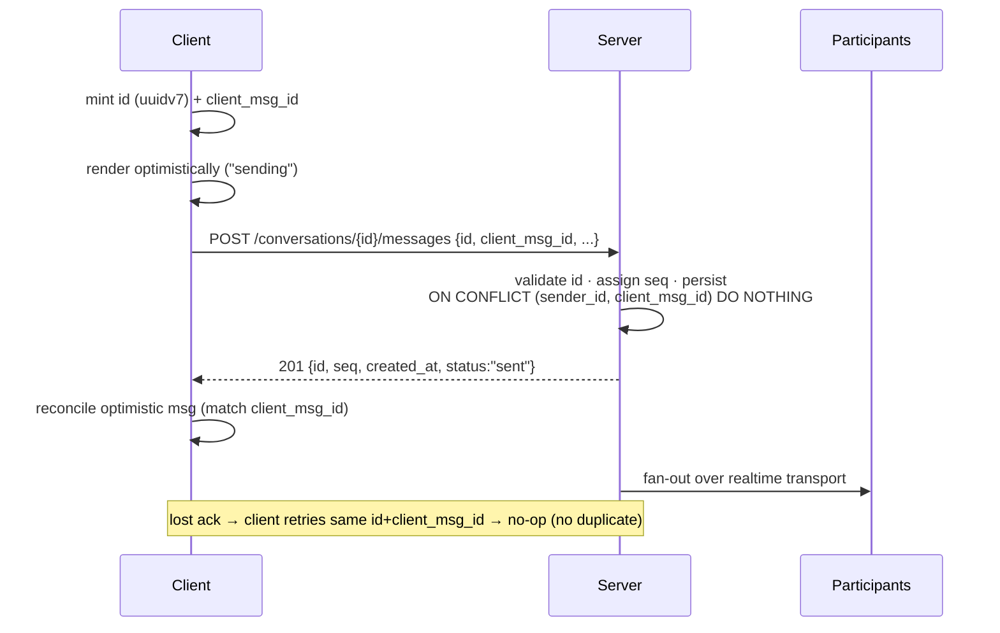
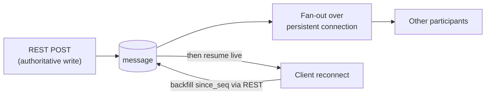

<!-- markdown-link-check-disable -->
# Summary

How to implement the chat-style messaging behind the home feed and report threads in
[prd-001](../prds/prd-001-animal-rescue-platform.md) (§5.2, §5.3, §7): message data
model, identifiers, send/delivery lifecycle, ordering, idempotency, and realtime
transport.

| Term | = prd-001 entity |
| --- | --- |
| **message** | `Reply` (text/media post, or moderator feed message) |
| **conversation** | `Thread` (one per report case) |

# Motivation

Rescue coordination is real-time over unreliable mobile networks. The model must:

| Need | Why |
| --- | --- |
| Stable id at compose time | optimistic render + reconcile on ack |
| No duplicates on retry | lost ack → resend must not double-post |
| Strict, gap-detectable order | clients detect missing messages and backfill |
| Cheap "load older" | keyset pagination, no offset scans |

Closes: identifier strategy · idempotency/optimistic-send · per-thread ordering · realtime
delivery + backfill.

# Conventions Assumed

Inherits [rfc-001](rfc-001-phone-otp-login.md) conventions (REST/JSON, `snake_case`, JWT)
and adds one, stated provisionally (ratify in a realtime **ADR**):

> [!NOTE]
> **Realtime transport** — one persistent connection per client for fan-out/presence;
> REST stays the authoritative write + backfill path.
> *[TODO: WebSocket vs. SSE+REST vs. managed pub/sub — see Unresolved Questions.]*

# Detailed Design

## Identifier strategy

Two identifiers, distinct owners — the core decision.

| Field | Minted by | Trusted | Purpose | Unique |
| --- | --- | --- | --- | --- |
| `id` | client (**UUIDv7**) | yes, once accepted | identity · ordering · pagination · FK | global |
| `client_msg_id` | client (UUID) | **no** | idempotency / dedup on retry | per sender |

- **`id` = UUIDv7** → time-ordered (free cursor pagination), near-sequential PK inserts
  (good index locality), client-mintable (optimistic render). Server validates on accept
  (well-formed v7, timestamp within skew window).
- **`client_msg_id`** → stable token reused on every retry; `UNIQUE (sender_id,
  client_msg_id)` makes a resend a no-op. Never trusted as identity, never used for order.

> [!TIP]
> `id` is the server's truth; `client_msg_id` is how the server recognizes a retry it has
> already stored. Single-id options (Snowflake, trusted-client-id, UUIDv4) are rejected in
> [Alternatives](#alternatives).

## Data model

| Constraint / index | Role |
| --- | --- |
| `PRIMARY KEY (id)` | identity, time-ordered |
| `UNIQUE (sender_id, client_msg_id)` | idempotency |
| `UNIQUE (conversation_id, seq)` | gapless per-thread order |
| `INDEX (conversation_id, id)` | keyset pagination |

> [!NOTE]
> **`seq`** is a server-assigned per-conversation monotonic int — gives strict ordering +
> gap detection (holding 41, receiving 43 ⇒ backfill 42), which timestamps can't under
> clock skew. Display order = `ORDER BY id`; `seq` is the integrity signal.
> *[TODO: gapless vs. allow-gaps; per-recipient receipts vs. aggregate `status`; media
> upload → own RFC.]*

## Send lifecycle

## Ordering, pagination & backfill

| Operation | Mechanism |
| --- | --- |
| Load older | `WHERE conversation_id=? AND id < :cursor ORDER BY id DESC LIMIT n` |
| Reconnect backfill | client sends highest known `seq`; server returns `seq > since` |
| Gap repair | missing interior `seq` ⇒ targeted range request *[TODO: API shape]* |

## Realtime delivery

*[TODO: presence / typing indicators in v1 or deferred?]*

## API Changes

| Endpoint | Body → Response |
| --- | --- |
| `POST /conversations/{id}/messages` | `{id, client_msg_id, type, body?, media?, metadata?}` → `201 {id, seq, created_at, status}` (idempotent) |
| `GET /conversations/{id}/messages?before={id}&limit={n}` | keyset page, newest-first |
| `GET /conversations/{id}/messages?since_seq={seq}` | reconnect backfill |
| `PATCH /messages/{id}` | edit / soft-delete *[TODO: window, who]* |
| `POST /messages/{id}/receipt` | `{status:"delivered"\|"read"}` *[TODO: batch]* |

## Data Model Changes

| Entity | Change |
| --- | --- |
| **`message`** (new) | as above; supersedes prd-001 §7 `Reply` |
| **`Thread`** | add `last_seq` (source for next `seq`); `last_activity` exists |
| **Receipts** | *[TODO: `message_receipt` table vs. aggregate `status`]* |

## Migration Strategy

Greenfield — no data to migrate; `message` replaces the placeholder `Reply` before any
rows exist. *[TODO: seed/test data ⇒ backfill `seq`.]*

# Drawbacks

| Drawback | Note / mitigation |
| --- | --- |
| Two ids per message | small complexity; buys idempotency + optimistic send |
| UUIDv7 native support uneven | Postgres ≥ v18, else app/library *[TODO: confirm store]* |
| Per-conversation `seq` counter | write-serialization point per thread; fine at human pace |
| UUIDv7 leaks creation time | OK for messages; keep tokens/handles on UUIDv4 (rfc-001) |

# Alternatives

| Option | Verdict |
| --- | --- |
| Snowflake (64-bit) sole PK | ✗ not safely client-mintable (worker-id/clock infra), no optimistic id |
| Trusted client id sole PK (WhatsApp-style) | ✗ buggy/malicious client can collide/overwrite; no server identity |
| Random UUIDv4 PK | ✗ not ordered → poor index locality + separate cursor needed |
| `seq` only (no UUID) | ✗ not globally unique, not client-mintable; kept as secondary field |
| Reuse bare `Reply` | ✗ leaves identity/idempotency/order unspecified |

# Adoption Strategy

Implicit — every report interaction is a message; no data to migrate. Client work:
optimistic send (mint id + `client_msg_id`), reconnect backfill by `seq`,
sending/sent/delivered/read states.

# Unresolved Questions

- **Datastore** — Postgres (+ version for native UUIDv7) vs. partition/sort-key store
  (DynamoDB/Scylla: `conversation_id` partition + `seq` sort). Capture in ADR.
- **Realtime transport** — WebSocket vs. SSE+REST vs. managed pub/sub.
- **`seq` semantics** — gapless vs. allow-gaps.
- **Group read receipts** — per-recipient vs. aggregate (fan-out cost).
- **Edit/delete policy** — window, tombstone visibility, moderator override.
- **Media upload** — separate RFC.

# Future Possibilities

- 1:1 direct messages (same model, non-thread conversation).
- Reactions / mentions / threaded replies via `metadata.reply_to_id`.
- E2E or at-rest encryption for sensitive contact exchange.
- Message search across a group's threads.
- Offline outbox — queue client-minted messages, flush on reconnect.
