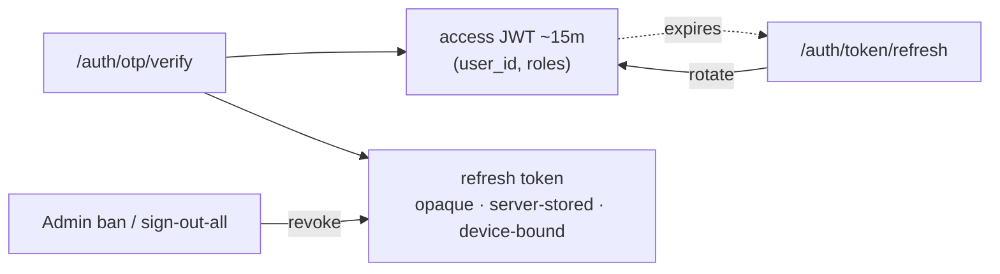
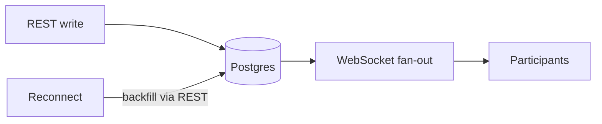
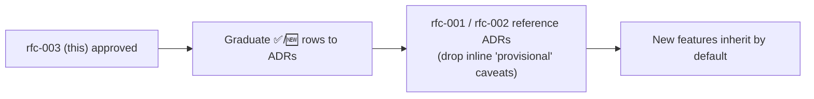

<!-- markdown-link-check-disable -->
# Summary

[rfc-001](./rfc-001-phone-otp-login.md) surfaced cross-cutting decisions provisionally
and said they should be ratified “once a second feature (rfc-002) confirms the pattern.”
[rfc-002](./rfc-002-chat-messaging.md) is that feature.
This RFC **collects every provisional assumption** from both and **proposes a concrete
decision** for each, so every future endpoint builds on a settled foundation.

> [!NOTE]
> Per rfc-001, these conventions ultimately belong in **ADRs**. This RFC is the
> proposal; on approval, each ✅ row graduates into a short ADR (see
> [Adoption](#adoption-strategy)).

# Motivation

Assumptions currently live as inline caveats in two RFCs.
Without a single ratified source they drift, get re-litigated per feature, and leave new
endpoints guessing.

# Decisions at a glance

Legend: ✅ propose to confirm · 🆕 newly proposed here · ⏳ defer (feature-local)

| # | Area | Decision | Status | Source |
| --- | --- | --- | --- | --- |
| 1 | Transport | REST-style JSON over HTTP | ✅ | rfc-001 |
| 2 | API versioning | `/v1` prefix from day one | 🆕 | rfc-001 (open) |
| 3 | Field casing | `snake_case` in bodies | ✅ | rfc-001 |
| 4 | Timestamps | UTC `timestamptz`; ISO-8601 in payloads | 🆕 | implied |
| 5 | Identifiers | UUIDv7 for entity PKs; UUIDv4 for secrets/tokens | 🆕 | rfc-002 |
| 6 | Datastore | PostgreSQL (primary) | 🆕 | rfc-002 (open) |
| 7 | Sessions | JWT access (~15m) + rotating server-stored refresh | ✅ | rfc-001 |
| 8 | AuthZ / roles | Admin · Moderator · Rescuer (claims in token) | ✅ | prd-001 §2.1 |
| 9 | Idempotency | `Idempotency-Key` header on unsafe POSTs | 🆕 | rfc-002 |
| 10 | Pagination | keyset/cursor on time-ordered id | 🆕 | rfc-002 |
| 11 | Realtime | one WebSocket/client; REST authoritative | 🆕 | rfc-002 (open) |
| 12 | Errors | standard error envelope | 🆕 | implied |
| 13 | Soft delete | `deleted_at` tombstone | ✅ | rfc-002 |
| 14 | Rate limiting | layered, multi-key | ✅ | rfc-001 |

# Proposed decisions (detail)

## 2 · API versioning 🆕

`/v1/...` prefix on every route now.
Cheap insurance; avoids a painful retrofit when a breaking change lands.
Bump the prefix only on incompatible changes; additive fields are not breaking.

## 4 · Timestamps 🆕

Store `timestamptz` (UTC). Serialize as ISO-8601 `Z` strings.
Never store local time.

## 5 · Identifiers 🆕 (generalizes rfc-002)

| Use | Type | Why |
| --- | --- | --- |
| Entity primary keys | **UUIDv7** | time-ordered → cursor pagination + good index locality; client-mintable |
| Secrets / tokens / unguessable handles | **UUIDv4** (or CSPRNG) | no timestamp leak, not enumerable |

> [!TIP]
> Mirrors rfc-002: `id` (UUIDv7) is identity/order; OTP codes, refresh tokens, share
> links stay random.

## 6 · Datastore 🆕

**PostgreSQL** as the primary store — relational fit for
User/Group/Report/Thread/Message, JSONB for `media`/`metadata`, modest per-city scale.

> [!IMPORTANT]
> Pin **Postgres ≥ 18** for native `uuidv7()`; on older versions generate ids in-app.
> If a thread ever needs partition/sort-key scale, revisit a wide-column store (rfc-002
> Unresolved) — not anticipated at launch.

## 7 · Sessions ✅



## 9 · Idempotency 🆕 (generalizes rfc-002 `client_msg_id`)

Every unsafe POST that may be retried carries a client-generated `Idempotency-Key`.
Server stores `(actor, key) → result`; replays return the stored result instead of
re-executing. Messaging’s `client_msg_id` is the per-feature instance of this rule.

## 10 · Pagination 🆕

List endpoints use keyset/cursor on a time-ordered id (`?before={id}&limit={n}`),
newest-first. No offset pagination.

## 11 · Realtime 🆕

One persistent **WebSocket** per client for fan-out + presence; **REST is
authoritative** for writes and reconnect backfill.



*[TODO: self-hosted WS vs. managed pub/sub — spike before commit.]*

## 12 · Errors 🆕

Uniform envelope on every non-2xx:

```json
{ "error": { "code": "rate_limited", "message": "Too many requests", "details": {} } }
```

Stable machine `code` + human `message`; `details` optional.

# Deferred (feature-local) ⏳

Stay in their owning RFC, not platform conventions:

| Item | Owner |
| --- | --- |
| OTP provider (Twilio Verify vs. self-managed) | rfc-001 |
| Exact rate-limit thresholds | rfc-001 |
| `seq` gapless vs. allow-gaps | rfc-002 |
| Group read receipts (per-recipient vs. aggregate) | rfc-002 |
| Edit/delete window & moderator override | rfc-002 |
| Media upload | future RFC |

# Drawbacks

| Decision | Risk / cost |
| --- | --- |
| `/v1` from day one | minor ceremony before any breaking change exists |
| Postgres-only | revisit if a thread needs wide-column scale (unlikely at launch) |
| UUIDv7 PKs | needs Postgres ≥ 18 or app-side generation |
| Single WebSocket | connection management + reconnect/backfill complexity |

# Alternatives

| Area | Alternative | Why not |
| --- | --- | --- |
| Versioning | header/media-type versioning | less visible; URL prefix is simpler to route/cache |
| Identifiers | Snowflake / UUIDv4 PKs | see rfc-002 Alternatives |
| Datastore | DynamoDB/Scylla first | relational fit + small scale favor Postgres now |
| Realtime | long-poll / SSE-only | weaker for bidirectional presence/typing |
| Errors | bare HTTP status only | no machine-stable code for clients |

# Adoption Strategy



On approval, emit one ADR per cluster (e.g. *API conventions*, *Identifier standard*,
*Session model*, *Realtime transport*), then trim the “Conventions Assumed” caveats in
rfc-001/rfc-002 to point at them.

# Unresolved Questions

- Realtime: self-hosted WebSocket vs.
  managed pub/sub (cost + ops).
- Datastore: confirm Postgres version / managed provider.
- Whether AuthZ warrants a dedicated policy layer or token-claim checks suffice at
  launch.

# Future Possibilities

- API conventions linter / shared request-response middleware enforcing §3, §4, §9, §12.
- OpenAPI spec generated from the conventions for client SDKs.
- Per-environment config ADR (secrets, regions, observability).
